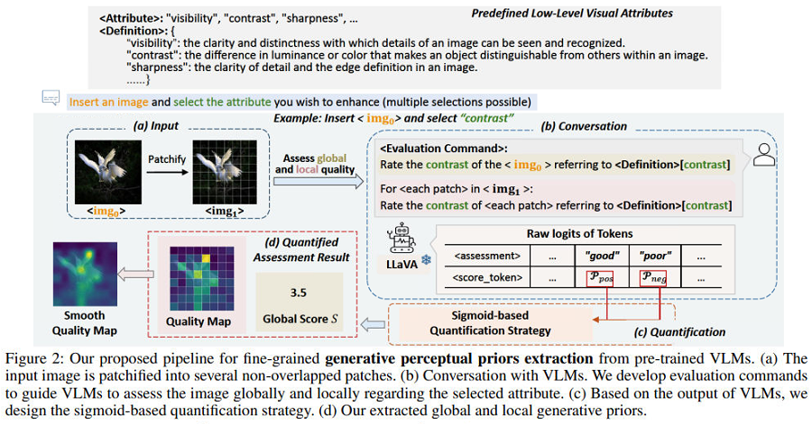
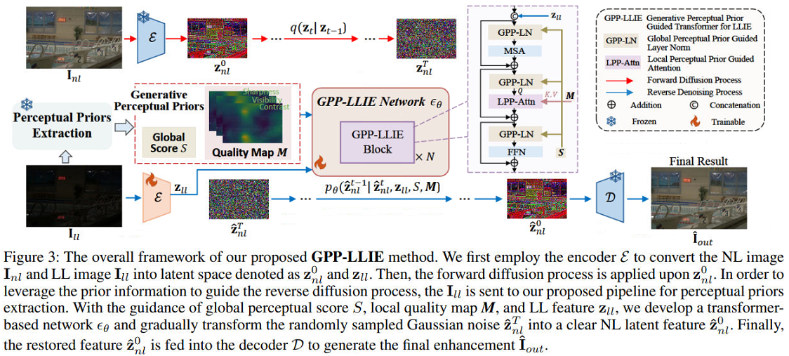

#  [AAAI 2025] Low-Light Image Enhancement via Generative Perceptual Priors [[Paper]](https://arxiv.org/pdf/2412.20916)

<h4 align="center">Han Zhou<sup>1,*</sup>, Wei Dong<sup>1,*</sup>, Xiaohong Liu<sup>2,&dagger;</sup>, Yunlun Zhang<sup>2</sup>, Guangtao Zhai<sup>2</sup>, Jun Chen<sup>1</sup></center>
<h4 align="center"><sup>1</sup>McMaster University, <sup>2</sup>Shanghai Jiao Tong University, 
<h4 align="center"><sup>*</sup>Equal Contribution, <sup>&dagger;</sup>Corresponding Author</center></center>


### Introduction
This repository represents the official implementation of our AAAI 2025 paper titled **Low-Light Image Enhancement via Generative Perceptual Priors**. If you find this repo useful, please give it a star ⭐ and consider citing our paper in your research. Thank you.

[](https://www.apache.org/licenses/LICENSE-2.0)

We present **GPP-LLIE**, a novel **LLIE** framework with the guidance of **G**enerative **P**erceptual **P**riors.

- **VLM-based Generative Perceptual Priors Extraction Pipeline**: extract generative perceptual priors for LL images globally and locally based on pre-trained VLMs.
- **Transformer-based Diffusion Framework**: develop a Transformer-based diffusion framework for LLIE.
- **Guidance of Perceptual Priors in the Reverse Diffusion Process**: leverage global perceptual priors to modulate the
layer normalization (GPP-LN) and utilize local perceptual priors to guide the attention mechanism (LPP-Attn) to benefit the enhancement process.

### Our Proposed VLM-based Generative Perceptual Priors Extraction Pipeline 


### Overall Framework


## 📢 News
**2025-8-27:** The pre-trained weight for LOLv2-syn dataset is provided. 🏃 <br>
**2025-8-12:** We release the **Generative Perceptual Prior Extraction** pipeline, as well as the generated global and local priors for LOLv2-real and LOLv2-syn datasets. We release our generated global and local priors for LOLv1. Test and Training codes are provided. 🚀 <br>
**2025-7-22:** Link for pre-trained weight (LOLv1) is released. We release our generated global and local priors for LOLv1. Test and Training codes are provided. ⭐ <br>
**2025-6-12:** This repo has been updated. The proposed VLM-based generative perceptual priors extraction pipeline has been added. ⭐ <br>

## 🛠️ Setup

The  code was tested on:

- Python 3.8, CUDA 11.6, GeForce RTX 2080Ti or higher GPU RAM.

### 📦 Repository

Clone the repository (requires git):

```bash
git clone https://github.com/LowLevelAI/GPP-LLIE.git
cd GPP-LLIE
```

### 💻 Dependencies

- **Make Conda Environment:** 

    ```bash
    conda create -n gppllie python=3.8
    conda activate gppllie
    ```
- **Then install dependencies:**

  ```bash
  pip install torch==1.13.0+cu117 torchvision==0.14.0+cu117 torchaudio==0.13.0 --extra-index-url https://download.pytorch.org/whl/cu117
  pip install pyiqa==0.1.4 pytorch-lightning==1.9.0 natsort lpips opencv-python
  ```

- **Build CUDA extensions:**
  
  ```bash
  cd defor_cuda_ext
  BASICSR_EXT=True python setup.py develop
  ```

- **Move CUDA extensions** (/defor_cuda_ext/basicsr/ops/dcn/deform_conv_ext.xxxxxx.so) to the path: **/ops/dcn/**.


## 🏃 Testing

### 📷 Download LOLv1 Dataset and Our Generated Global and Local Priors:
- LOLv1 [Google Drive](https://drive.google.com/file/d/1L-kqSQyrmMueBh_ziWoPFhfsAh50h20H/view?usp=sharing)
- Generative Priors for LOLv1 [Drive](https://mcmasteru365-my.sharepoint.com/:f:/g/personal/dongw22_mcmaster_ca/EhfamLbh7gZLoW99BlmHFU0BQYwWFKgqL3Erfs9dXkiYgA?e=xWre1r)

### ⬇ Download Pre-trained Weight for LOLv1

Download [Pre-trained weight for LOLv1 Dataset](https://mcmasteru365-my.sharepoint.com/:u:/g/personal/dongw22_mcmaster_ca/EWTcRm7rQc5Ao3qfLcc98wkBhBByYPnMN7csOPBJREV0TA). 

### 📷 Download Our Generated Global and Local Priors for LOLv2-syn Dataset:
- Generative Priors for LOLv2-syn [Drive](https://mcmasteru365-my.sharepoint.com/:f:/r/personal/dongw22_mcmaster_ca/Documents/25AAAI-GPP-LLIE/LOLv2-syn_global_local_priors?csf=1&web=1&e=d6Jq4U)

### ⬇ Download Pre-trained Weight for LOLv2-syn

Download [Pre-trained weight for LOLv2-syn Dataset](https://mcmasteru365-my.sharepoint.com/:u:/g/personal/dongw22_mcmaster_ca/EXp1-7vgRrlHpd_gvkhBqBMBRJK33lD-oJG904jo06sF7A?e=irHEKm). 

### 🚀 Run inference
- Inference without GT mean adjustment

```bash
python test.py
```

- Inference with GT mean adjustment

```bash
python test_adjust.py
```

Please update the weight path, input_dir in the test code. You can also find save_dir for outputs there. For your convenience, results obtained from our device can be found here: [LOLv1 With GT](https://mcmasteru365-my.sharepoint.com/:f:/g/personal/dongw22_mcmaster_ca/EoME8pKrLtdAs9ePRKpY9nIB_eWEcnNlwZZT-wYCVwvWHw?e=hrV22C), [LOLv1 Without GT](https://mcmasteru365-my.sharepoint.com/:f:/g/personal/dongw22_mcmaster_ca/EjvlFOE1IBVKsSdq6uXS7eEBnYyfmALci6ZocY60aOpSAw?e=Ekz6eo), [LOLv2-syn Without GT](https://mcmasteru365-my.sharepoint.com/:f:/g/personal/dongw22_mcmaster_ca/En7W4iIkswFCiBlsvMMnx48B3UL3CuPg8sCb6niSAVqPtg?e=r7w7Dl), [LOLv2-syn With GT](https://mcmasteru365-my.sharepoint.com/:f:/g/personal/dongw22_mcmaster_ca/EvZGDn2KpkdBlcBxYyNkFasBHPkQWAGzp1bcbzqlJU0jlg?e=Bz3mAD).

## 🏋️ Training

Please follow above instructions to load  dataset, generative priors, and pre-trained weight (we need the state_dict of vae for training).

First, train the diffusion transformer mdoel and the conditional encoder.

```bash
python train_dit.py
```

Second, train the second decoder for enhanced performance.

```bash
python train_decoder2.py
```

## :page_facing_up: Generative Perceptual Prior Extraction Pipeline
Please go to [Generative Perceptual Prior Extraction Pipeline](Generative-Perceptual-Prior-Extraction/README.md) for detailed instruction. Our generated generative priors can be found here:  [LOLv2_real](https://mcmasteru365-my.sharepoint.com/:f:/g/personal/dongw22_mcmaster_ca/Env3QgH_9RpKpoTH8hotD3IB0FayQV22-qPfVJpZ374hEw?e=1qaDxW), [LOLv2_syn](https://mcmasteru365-my.sharepoint.com/:f:/g/personal/dongw22_mcmaster_ca/EmwO94K832ROg9db47x6MZ8BUDpVJJqOqJgercLFXrQefw?e=mr51eT).


## ✏️ Contributing

Please refer to [this](CONTRIBUTING.md) instruction.

## 🎓 Citation

If you find this repo and our paper useful, please consider citing our paper:

```bibtex
@inproceedings{zhou2025gppllie,
  title={Low-light image enhancement via generative perceptual priors},
  author={Zhou, Han and Dong, Wei and Liu, Xiaohong and Zhang, Yulun and Zhai, Guangtao and Chen, Jun},
  booktitle={Proceedings of the AAAI Conference on Artificial Intelligence},
  volume={39},
  number={10},
  pages={10752--10760},
  year={2025}
}

```


## 🎫 License

This work is licensed under the Apache License, Version 2.0 (as defined in the [LICENSE](LICENSE.txt)).

By downloading and using the code and model you agree to the terms in the  [LICENSE](LICENSE.txt).

[](https://www.apache.org/licenses/LICENSE-2.0)
